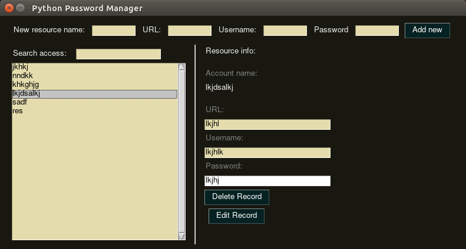

# python simple password manager
A small simple password manager written in python. It contains one python file and generates a .dat file with your encrypted passwords.

You need Python3 and the following two libraries: 
pip3 install rncryptor 
pip3 install PySimpleGUI

<b>BE SURE TO CHOOSE A STRONG MASTER PASSWORD!</b> I can not stress this enough, as anyone who gets a copy of your .dat file will be able to make unrestricted bruteforce attempts on the file. I would suggest that you use a combination of symbøls, leTteRs and num6ers. And use atleast 10 characters, it will currently take many years to crack on a supercomputer or a huge botnet (but keeping Moore's law in mind, things would be different in 10 years time. So, better be safe than sorry)

<b>Why have your own small password script?</b> I also have a more general purpose password manager residing somewhere in the cloud, syncronising over the web to all my devices (safe as well as unsafe endpoint) with access to browsers etc. I hope you can follow my concerns allready. 

The basic idea is to be able to carry the most important passwords around in your pocket (flash stick or an old 32MB SD-card in my case), and instead make a backup of the .dat file, from time to time on a second SD-card. 

This is basically all there is, in regards to user options. Your are welcome to change the script in anyway you like... 

Just download <b>"the py_pwm.py"</b> file and execute it... The first run creates the "my_manager.dat" file and encrypt it with your choosen password. 

